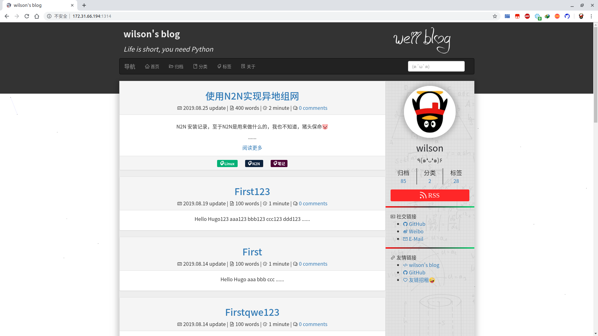

# Hugo Theme Weii

[](https://github.com/wevsmy/hugo-theme-weii/blob/master/LICENSE)

> 该主题移植自 [hexo-theme-aria](https://github.com/AlynxZhou/hexo-theme-aria/)，使用Bootstrap 3。

**在线预览**：[Demo](https://blog.weii.ink)

## 截图



## 安装

首先进入 hugo 的站点目录运行下面的命令：

```bash
$ git clone https://github.com/wevsmy/hugo-theme-weii themes/weii
```

## 主题调试
```bash
$ hugo server --theme=weii --buildDrafts --config=themes/weii/exampleSite/config.toml --bind 0.0.0.0
```

## 部署
```bash
$ hugo --theme=weii --baseUrl="http://wevsmy.github.io/"
```

本主题提供了一个示例配置文件是 [`exampleSite`](./exampleSite) 目录里的 [`config.toml`](./exampleSite/config.toml) 文件。

配置文件中对大部分配置都有详细的注释说明，复制该文件到站点目录下，根据自己的情况修改即可。

更多安装信息查看 Hugo 官方文档 [setup guide](https://gohugo.io/overview/installing/)。

## 示例站点

`exampleSite` 是本主题的一个示例站点，里面有配置文件、关于页面的一些示例。

## 关于页面

使用关于页面，首先要在你的站点目录的 [`content`](./exampleSite/content/) 目录下创建一个 [`about`](./exampleSite/content/about/) 目录，然后再创建一个 [`index.md`](./exampleSite/content/about/index.md) 文件，最后编写该文件即可。

## Logo

你需要将 [`images`](./static/images/) 目录下的 `logo.svg`、`favicon.ico` 都替换为你自己的图像。

## 隐藏页面

如果你不想让一个页面出现在文章列表中，只需要在 markdown 文件的 `frontmatter` 中添加 `hidden: true` 即可。

然后你可以在其他任何地方通过链接来引用该页面，如在菜单中放置一个链接。

## 评论系统

本主题提供了disqus,commentjs,valine

## 社交链接

本主题的社交链接是字体图标的样式，并放置在了页面头部。你可以通过在 [`config.toml`](./exampleSite/config.toml) 的 `[social]` 模块中修改添加你的社交链接。

## 部署主题

配置完成之后，就可以使用下面的命令来启动 hugo 服务编译 markdown 文件生成静态站点：

```bash
$ hugo server
```

然后在浏览器地址栏输入 [localhost:1313](http://localhost:1313) 来访问站点。

## License

Released under the [MIT](https://github.com/wevsmy/hugo-theme-weii/blob/master/LICENSE) License.

## 致谢

- [hexo-theme-aria](https://github.com/AlynxZhou/hexo-theme-aria/)


